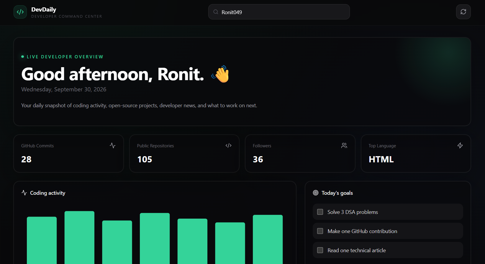
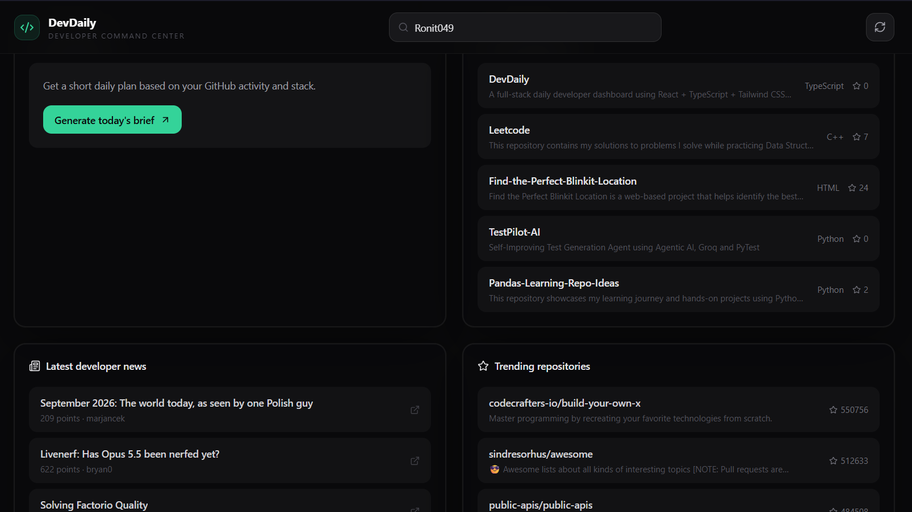

# ⚡ DevDaily

<p align="center">
  
</p>

<p align="center">
  <strong>A modern full-stack developer dashboard built to bring your daily coding workflow into one place.</strong>
</p>

<p align="center">
  <a href="https://github.com/Ronit049/DevDaily">
    
  </a>
  <a href="https://github.com/Ronit049/DevDaily/network/members">
    
  </a>
  
  
</p>

<p align="center">
  <a href="#-features">Features</a> •
  <a href="#-tech-stack">Tech Stack</a> •
  <a href="#-architecture">Architecture</a> •
  <a href="#-installation">Installation</a> •
  <a href="#-api">API</a> •
  <a href="#-roadmap">Roadmap</a>
</p>

---
<p align="center">
  
</p>

### Dashboard

> Add your dashboard screenshot here after running the application.

```text
screenshots/dashboard.png
```

You can later replace this section with:

```markdown
<p align="center">
  
</p>
```
---

## 🖥️ About The Project

**DevDaily** is a full-stack developer dashboard designed to give developers a single place to track their coding activity, discover technology news, manage daily goals, and get AI-powered insights.

Instead of opening multiple websites every day, DevDaily brings your developer workflow together in one dashboard.

> **Build. Track. Learn. Ship. 🚀**

---

## ✨ Features

### 🐙 GitHub Dashboard

Connect your GitHub profile and view important developer statistics:

* 👤 GitHub profile
* 📦 Public repositories
* ⭐ Repository stars
* 👥 Followers
* 🔥 Recent activity
* 📈 Developer statistics

---

### 📰 Tech News

Stay updated with the latest developer and technology news using the Hacker News API.

* Latest stories
* Story scores
* Comment counts
* Direct links
* Real-time API data

---

### 🤖 AI Developer Brief

Get a concise AI-generated daily developer brief.

The dashboard can summarize what's happening across your developer workflow and provide useful insights.

Powered by:

**Groq + Llama**

---

### 🎯 Daily Goals

Set and track your daily development goals.

Examples:

```text
☐ Solve 3 DSA problems
☐ Complete today's project task
☐ Read 2 technical articles
☐ Push code to GitHub
☐ Learn one new concept
```

Goals are stored locally using browser `localStorage`.

---

### 📊 Activity Visualization

Track your development activity through interactive charts.

Built using:

* Recharts
* React
* TypeScript

---

### 🌐 API-Driven Architecture

DevDaily is designed around external APIs instead of hardcoded data.

Current integrations include:

```text
GitHub API
     │
     ▼
FastAPI Backend
     │
     ├── GitHub Data
     ├── Hacker News
     └── Groq AI
             │
             ▼
      React Dashboard
```

---


---

# 🛠️ Tech Stack

## Frontend

<p>


</p>

## Backend

<p>


</p>

## APIs & AI

<p>


</p>

---
---

# 🖥️ DevDaily Dashboard

<p align="center">
  
</p>

<p align="center">
  <em>
    A real-time developer command center showing GitHub activity,
    repositories, followers, coding activity, and daily goals.
  </em>
</p>

<br>

<p align="center">
  
</p>

<p align="center">
  <em>
    Developer news, AI-powered daily briefs, repositories,
    and trending projects in one place.
  </em>
</p>

---

## 🎯 What You Can See

### 📊 Developer Overview

The main dashboard provides a quick snapshot of your developer activity:

- 🐙 GitHub activity
- 📦 Public repositories
- 👥 Followers
- 💻 Top programming language
- 📈 Coding activity
- 🎯 Daily goals

### 🤖 AI Daily Brief

Generate a personalized developer brief based on your GitHub activity and technology stack.

```text
Your GitHub Activity
        ↓
Developer Profile
        ↓
AI Analysis
        ↓
Personalized Daily Brief
---

# 🏗️ Architecture

```text
                    ┌──────────────────────┐
                    │      DevDaily UI     │
                    │ React + TypeScript   │
                    │ Tailwind + Recharts  │
                    └──────────┬───────────┘
                               │
                               │ REST API
                               ▼
                    ┌──────────────────────┐
                    │    FastAPI Server    │
                    │       Python         │
                    └──────────┬───────────┘
                               │
              ┌────────────────┼────────────────┐
              │                │                │
              ▼                ▼                ▼
       ┌────────────┐   ┌────────────┐   ┌────────────┐
       │ GitHub API │   │ Hacker News│   │  Groq AI   │
       └────────────┘   └────────────┘   └────────────┘
```

---

# 📁 Project Structure

```text
DevDaily/
│
├── backend/
│   │
│   ├── app/
│   │   ├── services/
│   │   │   ├── github.py
│   │   │   ├── news.py
│   │   │   └── ai.py
│   │   │
│   │   ├── config.py
│   │   ├── models.py
│   │   └── main.py
│   │
│   ├── .env.example
│   └── requirements.txt
│
├── frontend/
│   │
│   ├── src/
│   │   ├── components/
│   │   ├── lib/
│   │   ├── App.tsx
│   │   ├── index.css
│   │   └── main.tsx
│   │
│   ├── package.json
│   ├── tailwind.config.js
│   └── vite.config.ts
│
├── .gitignore
├── README.md
├── start-backend.ps1
└── start-frontend.ps1
```

---

# ⚙️ Installation

## 1️⃣ Clone the repository

```bash
git clone https://github.com/Ronit049/DevDaily.git
cd DevDaily
```

---

## 2️⃣ Backend Setup

Move into the backend:

```bash
cd backend
```

Create a virtual environment:

### Windows

```powershell
python -m venv venv
```

Activate it:

```powershell
.\venv\Scripts\Activate.ps1
```

Install dependencies:

```powershell
python -m pip install -r requirements.txt
```

---

## 3️⃣ Configure Environment Variables

Create:

```text
backend/.env
```

Copy the example configuration:

```env
APP_NAME=DevDaily API
FRONTEND_ORIGIN=http://localhost:5173

GITHUB_TOKEN=
GROQ_API_KEY=
GROQ_MODEL=llama-3.3-70b-versatile
```

### 🔐 Important

Never commit your `.env` file.

Your `.gitignore` already excludes it.

---

## 4️⃣ Start Backend

From the `backend` directory:

```powershell
uvicorn app.main:app --reload
```

Backend:

```text
http://127.0.0.1:8000
```

API documentation:

```text
http://127.0.0.1:8000/docs
```

---

# 💻 Frontend Setup

Open another terminal.

```powershell
cd frontend
```

Install dependencies:

```powershell
npm install
```

Start development server:

```powershell
npm run dev
```

Open:

```text
http://localhost:5173
```

---

# 🔑 Environment Variables

| Variable          | Required | Description                 |
| ----------------- | -------- | --------------------------- |
| `GITHUB_TOKEN`    | Optional | GitHub API authentication   |
| `GROQ_API_KEY`    | Optional | Enables AI-generated briefs |
| `GROQ_MODEL`      | Optional | Groq model name             |
| `FRONTEND_ORIGIN` | Yes      | Frontend URL                |

The application can run with fallback/demo data when optional API credentials are unavailable.

---

# 🔌 API

DevDaily exposes backend endpoints through FastAPI.

### Health Check

```http
GET /
```

### Developer Dashboard

```http
GET /api/dashboard/{username}
```

Example:

```http
GET /api/dashboard/Ronit049
```

### News

```http
GET /api/news
```

### AI Brief

```http
POST /api/ai/brief
```

Interactive API documentation is available at:

```text
http://127.0.0.1:8000/docs
```

---

# 🚀 Development Workflow

```text
             Code
              │
              ▼
        ┌───────────┐
        │   React   │
        └─────┬─────┘
              │
              ▼
        ┌───────────┐
        │  FastAPI  │
        └─────┬─────┘
              │
       ┌──────┼──────┐
       ▼      ▼      ▼
    GitHub   HN     Groq
       │      │      │
       └──────┼──────┘
              ▼
        Developer Data
              │
              ▼
         Dashboard
```

---

# 🗺️ Roadmap

* [x] React dashboard
* [x] FastAPI backend
* [x] GitHub integration
* [x] Hacker News integration
* [x] Daily goals
* [x] Activity charts
* [x] Groq AI integration
* [x] Demo fallback data
* [ ] LeetCode statistics
* [ ] GitHub contribution heatmap
* [ ] GitHub Trending integration
* [ ] Coding streak tracker
* [ ] Developer productivity score
* [ ] Dark / light theme
* [ ] Authentication
* [ ] Cloud deployment
* [ ] PostgreSQL support
* [ ] Personalized AI recommendations

---

# 💡 Why DevDaily?

Developers often switch between multiple platforms every day:

```text
GitHub
  ↓
LeetCode
  ↓
Hacker News
  ↓
YouTube
  ↓
AI tools
  ↓
Notes
  ↓
Task manager
```

DevDaily aims to bring the most important parts of this workflow into **one developer-focused dashboard**.

---
1. Backend — already working ✅

Keep your current PowerShell window running:
```
cd C:\Users\iamro\Downloads\DevDaily-full-stack\devdaily\backend

.\venv\Scripts\Activate.ps1

uvicorn app.main:app --reload
```
You should see:

Uvicorn running on http://127.0.0.1:8000
Application startup complete.

Don't close this terminal.

2. Start the frontend

Open a new PowerShell window.
```
cd C:\Users\iamro\Downloads\DevDaily-full-stack\devdaily\frontend
```
Install packages once:
```
npm install
```
Then start the frontend:
```
npm run dev
```
You'll get something like:

VITE v...
➜  Local:   http://localhost:5173/
---
# 🤝 Contributing

Contributions are welcome!

```bash
# Fork the repository

# Create your feature branch
git checkout -b feature/amazing-feature

# Commit your changes
git commit -m "Add amazing feature"

# Push the branch
git push origin feature/amazing-feature

# Open a Pull Request
```

If you have an idea that could improve DevDaily, feel free to open an issue.

---

# ⭐ Support

If you find **DevDaily** useful:

⭐ Star the repository
🍴 Fork the project
🐛 Report bugs
💡 Suggest features
🔧 Submit pull requests

---

# 👨‍💻 Author

<p align="center">
  
</p>

<h3 align="center">Ronit Raj</h3>

<p align="center">
  Computer Science Student • Full-Stack Developer • AI Enthusiast
</p>

<p align="center">
  <a href="https://github.com/Ronit049">
    
  </a>
  <a href="https://rsr-portfolio.vercel.app/">
    
  </a>
</p>

---

<p align="center">
  <i>Built with ❤️, Python, React, APIs, and a lot of debugging.</i>
</p>

<p align="center">
  
</p>

<p align="center">
  ⭐ <strong>If DevDaily helped you, consider giving it a star!</strong> ⭐
</p>
